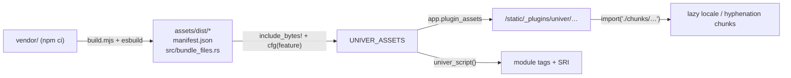

# ADR 0001: Vendor Univer as a code-split ES module bundle

- Status: accepted
- Date: 2026-10-08
- Applies to: autumn-plugin-univer 0.1.0, Univer 1.0.3, autumn-web 0.8.0

## Context

Univer 1.0 presets ship ES and CJS builds only. They ship no UMD build.
The Autumn default CSP is `script-src 'self'`. Host apps must not need npm,
a bundler or a CDN. One IIFE bundle is 11.3 MB: 4.4 MB of it is
hyphenation data that sheets seldom use, and each locale adds 0.7 MB.

## Decision

- `vendor/` pins the npm packages (`package-lock.json`). `build.mjs` runs
  esbuild: ESM, code splitting, minified, deterministic.
- The entry (`vendor/entry.js`) sets one global, `AutumnUniverLib`. Locale
  packs are dynamic imports.
- The output is committed in `assets/dist/`. `build.mjs` also writes
  `assets/manifest.json` (versions, `sha384` of each file) and
  `src/bundle_files.rs` (the `PluginAssets` file list).
- Lazy chunks compile in only with their Cargo feature (`locale-*`,
  `hyphenation`). `build.mjs` finds each chunk's feature from the esbuild
  metafile, including shared chunks.
- `UniverPlugin` installs one `PluginAssets` bundle (namespace `univer`).
  `univer_script()` emits two `type="module"` tags with SRI.

## Consequences

- Default build: about 7 MB of assets in the binary (1.7 MB gzip on the
  wire with compression). `all-locales` adds about 12 MB; `hyphenation` adds 4.6 MB.
- The entry and plugin files have SRI. Lazy chunks load by relative URL
  and have no SRI; their names hold a content hash.
- An update is `npm install` + `npm run build`. CI rebuilds and fails on a
  diff, so the committed bytes match the lockfile.
