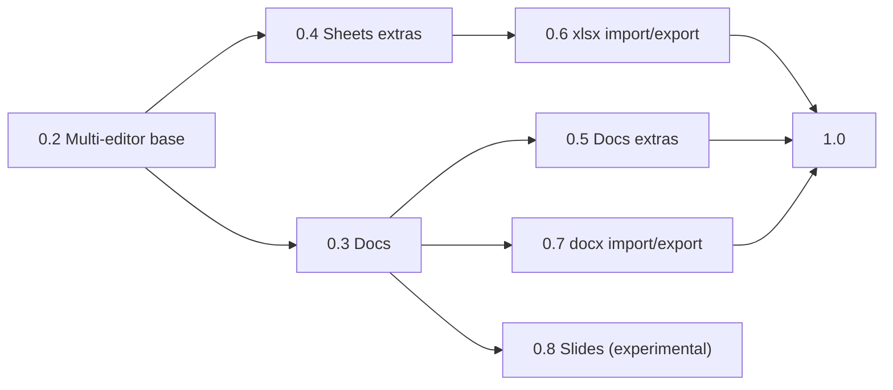

# Roadmap: the Univer office suite for Autumn

This roadmap adds docs and slides to the sheets plugin. It also adds the
optional Univer features and server-side file import and export. The
crate structure is in [ADR 0004](adr/0004-one-crate-feature-per-editor.md).

Status: draft. Data: Univer 1.0.3 on npm (2026-10-08).

## What Univer gives us

| Area | Univer packages | License | Status in 1.0.3 |
|---|---|---|---|
| Sheets core | `preset-sheets-core` | Apache-2.0 | Shipped in 0.1 |
| Sheets extras | `preset-sheets-{filter, sort, find-replace, data-validation, conditional-formatting, hyper-link, note, table, drawing, thread-comment}` | Apache-2.0 | Presets are available |
| Docs core | `preset-docs-core` | Apache-2.0 | Preset is available |
| Docs extras | `preset-docs-{drawing, hyper-link, thread-comment}` | Apache-2.0 | Presets are available |
| Slides | `slides`, `slides-ui` | Apache-2.0 | Plugins only: no preset, no Facade API |
| Charts, pivot tables, sparklines, print, xlsx/docx exchange | `preset-*-advanced` → `@univerjs-pro/*` | Proprietary | Needs a Univer Pro license |
| Live collaboration | `preset-*-collaboration` → `@univerjs-pro/*` | Proprietary | Needs Univer Pro and Univer Server |

## Phases

Every phase uses the 0.1 process: plan with AC, failing test first,
system tests in Chromium, 2–3 agent review rounds, an AC evidence table,
and green CI.

### 0.2: Multi-editor base (no new behavior)

Goal: get the code ready for more editor types. Sheets does not change.

- Add the Cargo feature `sheets` and add it to `default`.
- `vendor/build.mjs`: one entry point per editor type. The entry points
  share chunks. The file list and the manifest record the feature of each
  file.
- `init.js`: split the shared lifecycle from a sheets adapter. The
  adapter has `create`, `snapshot`, `isChange` and `setReadOnly`.
- Markup: `data-univer-kind="sheet"`. Markup without the attribute is a
  sheet, so 0.1 markup continues to work.
- Verus proof of the 8 `Workbook` invariants. This closes the 0.1 gap
  if Verus can be installed.

AC: the 25 system tests pass with no change. A `--no-default-features`
build compiles and serves no sheets files. The default bundle size does
not change by more than 1%.

### 0.3: Docs

Goal: rich-text documents with the same save model as sheets.

- Feature `docs` with `preset-docs-core`.
- `Document` builder (Maud) next to `Spreadsheet`.
- `DocumentData` model with its own invariants and `Limits`. It keeps
  unknown fields in `extra` (no data loss, as `Workbook`).
- `DocumentSnapshot` extractor (413/415/400/422, the same as sheets).
- Docs adapter in `init.js`.
- Demo page and README section.

Spike first: write the `DocumentData` invariants from Univer's
`IDocumentData` (body text, paragraph and text run ranges, styles).

AC: mount, edit, autosave, manual save, read-only, htmx swap and dispose
work for a document. One page with a sheet and a document works. Keys go
to the editor that has focus. This is a new system test, because the
fixed editor ids in ADR 0003 can also affect docs.

### 0.4: Sheets extras

Goal: the open-source sheet features, each behind a feature.

- Features: `sheets-filter`, `sheets-sort`, `sheets-find-replace`,
  `sheets-data-validation`, `sheets-conditional-formatting`,
  `sheets-hyper-link`, `sheets-note`, `sheets-table`, `sheets-drawing`,
  `sheets-thread-comment`, and `sheets-all`.
- Their data is in the workbook `resources`. Add typed read helpers to
  `Workbook` when an app needs them, such as filter ranges or validation
  rules.

Risks:
- `sheets-drawing`: images can need `blob:` or `data:` in the CSP.
  Test this under the default CSP before we ship it.
- `sheets-thread-comment`: comments can need a server data source. Do a
  spike to find out if the snapshot holds them.
- `sheets-hyper-link`: links must only open safe URL schemes. Add a
  system test.

### 0.5: Docs extras

- Features: `docs-drawing`, `docs-hyper-link`, `docs-thread-comment`,
  and `docs-all`.
- The CSP and URL scheme risks of 0.4 also apply here.

### 0.6: xlsx import and export (server side, Rust)

Goal: open and download Excel files without Univer Pro.

- Feature `xlsx`. It converts between `Workbook` and xlsx in Rust. It
  adds no browser code.
- Candidate crates: `calamine` (read) and `rust_xlsxwriter` (write).
  Check their licenses and features before we choose.
- First scope: values, formulas, sheet names and order, merges, column
  widths, row heights. Later scope: styles and number formats.
- Report data that the conversion cannot keep. Do not drop it silently.

AC: round-trip tests on real files. Property test: `Workbook` → xlsx →
`Workbook` keeps the first-scope data.

### 0.7: docx import and export (server side, Rust)

- Feature `docx`. It converts between `DocumentData` and docx.
- Do a spike first to find a Rust docx crate with a good license and
  enough features.
- The scope and AC follow the same pattern as 0.6.

### 0.8: Slides (experimental)

Univer 1.0.3 has slides plugins but no preset and no Facade API. We do
not know how stable they are.

- Spike: mount `slides` and `slides-ui` and do a snapshot round trip
  under the default CSP.
- If the spike passes: feature `slides-experimental`, a `Presentation`
  builder and a `SlidesData` model. Use "experimental" in the docs and
  in the feature name.
- If the spike fails: wait for an upstream preset, and do this check
  again after each Univer upgrade.

### 1.0

- Sheets, docs and xlsx are stable. The public API is frozen.
- Upgrade to the newest Univer 1.x. All system tests pass on it.
- Write a migration note from 0.x.

## Out of scope

- **Univer Pro** (charts, pivot tables, print, Univer exchange, live
  collaboration). It is proprietary, so we do not put it in an
  Apache-2.0 crate. An app with a Pro license can load Pro itself. We can
  write a short guide for this later.
- **Live collaboration without Pro.** It needs a command sync protocol
  and a server. This is a research item, not a phase.

## Cross-cutting rules

- All `@univerjs/*` packages stay on one version.
- A Univer upgrade runs all system tests and checks the three Univer
  workarounds in ADR 0003.
- Each feature has a bundle size budget. CI fails if the default build
  grows by more than the budget.
- The default CSP does not change. A feature that needs more CSP
  sources tells the app in its docs and in a test.

## Open questions

1. Is docs (0.3) more important than sheets extras (0.4)? They can run
   in parallel after 0.2.
2. Is server-side xlsx import and export in scope for this crate (feature
   `xlsx`), or is it a separate crate?
3. Do we want a guide for apps that use Univer Pro?
